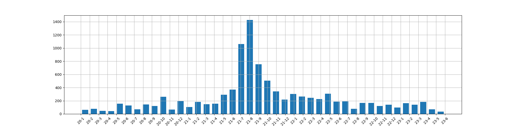

# Scrapping
CSV data processing and visualization of CrowdTangle dataset

# how to run
run `main.csv` to generate all plots, should be saved under locate path

# result
below is one demo of 1st plot, refer to full code for more plot descriptions

# how to get csv data
current using crowdTangle webpage tool, there are other tool like [PyTangle](https://github.com/hide-ous/pytangle) can help but not fully functional yet.
